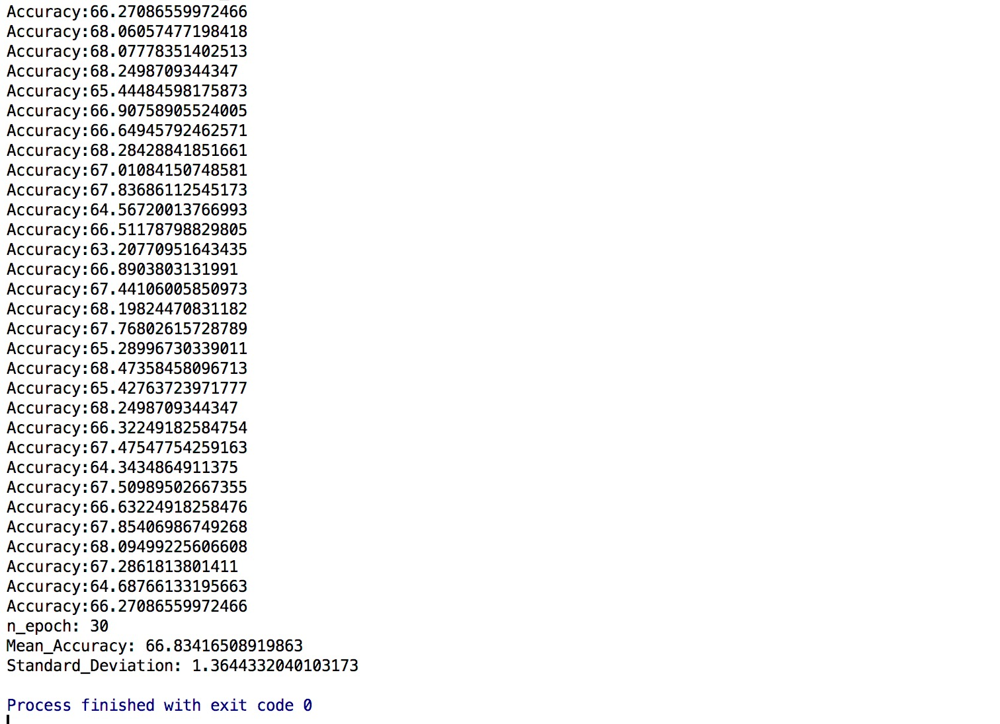
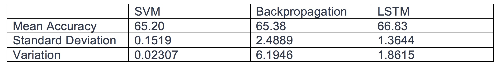
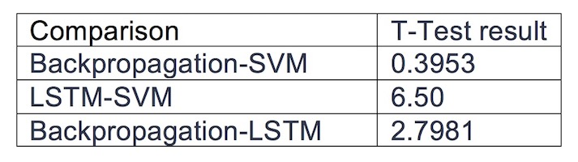

# Stock-predection
Stock Prediction using machine learning
## Abstract
Stock market prediction is the act of trying to determine the future value of a company stock or other financial instrument traded on an exchange. The successful prediction of a stock's future price could yield significant profit. The efficient-market hypothesis suggests that stock prices reflect all currently available information and any price changes that are not based on newly revealed information thus are inherently unpredictable. Others disagree and those with this viewpoint possess myriad methods and technologies which purportedly allow them to gain future price. With the advent of the digital computer, stock market prediction has since moved into the technological realm. The most prominent technique involves the use of artificial neural networks. ANNs can be thought of as mathematical function approximators. The most common form of ANN in use for stock market prediction is the feed forward network utilizing the backward propagation of errors algorithm to update the network weights. These networks are commonly referred to as Backpropagation networks. Also in recent year there is a significant improvement in SVM (Support vector machine Algorithm) implementation for stock prediction. Another form of ANN that is more appropriate for stock prediction is the time recurrent neural network (RNN) or time delay neural network (TDNN). One of the modified version of RNN is LSTM which memorize history data for prediction. Keeping this details in mind in this project I tried to predict stock trend. Also to the result includes conclusion for what algorithm performs well compare to the other two.
## Background
Previously SVM and Backpropagation were used for many classification problem and there were many instances where reasonable accuracy was achieved. Keeping that in mind our given problem statement was addressed to achieve as much accuracy as possible with tweaking algorithm. LSTM was used for many time series problems and the same approach is used to predict trend for stock by memorizing history data.

## Description
Problem statement was to predict increase or decrease in stock price for next day. I addressed this as classification problem. There are many classification algorithms in neural network. Our main goal was to compare performance of SVM, LSTM and Backpropagation algorithm. Once I got reasonable accuracy I try to compare their results.
## Approach
Our approach to for this project consist of major steps:

1. Dataset creation
2. Implementation of algorithm
3. Comparison of result and analysis

## 1.	Dataset creation :
For data collection I used yahoo finance. Yahoo Finance is a database with stock prices for various companies. Most of the companies I chose were in the sector of technology. Ex. Apple, Google, Yahoo, Microsoft etc. I collected data from January 2010 to December 2016. The stock market took a toll during 2007-2008 financial crisis. This time around, companies went in loss and stock data of companies completely unpredictable. Training our model using this data would cause our model to be less accurate because of a lack of trend during the crisis period. So I avoided data that can result into uncertain behavior

The data set contains stock data of the following companies:

*   Yahoo
*   Microsoft
*   Apple
*   Google
*   Lenovo
*   Intel
*   HP
*   Amazon
*   Oracle

For our problem I kept technology and software services as a sector. For that sector I tried to predict trend and behavior of stock.
These are all listed on the same index Nasdaq. The stock data obtained from yahoo contains the following parameters:

*   Date
*   Open
*   High
*   Low
*   Close
*   Adj Close
*   Volume

I took the daily closing values of each of the stock as the stock value for a day.

**Other parameters calculated for input dataset:**
Basic assumption in stock market is that stock momentum, increase or decrease will depend on how given stock was doing in past. Also, the stock price for given company will also depend on how market is doing and how given sector is doing. Keeping these three things in mind I calculated 5 attributes as listed below.

*   Index_Momentum
*   Index_Volatility
*   Sector_Momentum
*   Stock_Momentum
*   Stock_Price_Volatility
*   Output

**Momentum:** If price of stock or index in higher than yesterday then momentum for given day is +1 as there is an increase in price else it’s -1.

**Volatility:** Represents how big or small change in stock /index closing values. Try to capture fluctuation in market. For given day Volatility is calculated using difference between yesterday's closing value - today’s closing value divide by yesterday’s closing value.

**Index_Momentum:** Calculated based on market performance for last 5 days. It’s an average of 5 days index momentum.
Index_Volatility: Calculated as average of last 5 days Volatility for index.

**Sector_Momentum:** Calculated based on sector performance for last 5 days. It’s an average of 5 days index value for all technology company shares.

**Stock_Momentum:** Calculated as average for last 5 days momentum for given company momentum

**Stock_Price_Volatility:** Calculated as average of last 5 days for given stock.

For all attributes I kept 5 days as to capture market behavior. In future I will try change this for 10, 15 days and see if there is any improvement in accuracy. Once I calculated this attributes for each company I consolidated all dataset and created final input dataset.

**Output:** If closing stock price for a stock today day is more than yesterday’s closing stock price for the same stock, then the corresponding output is denoted by 1 else it is denoted as 0.

Hence. one record of our input data set had the following 6 dimensions:

*   Stock Price
*   Index_Momentum
*   Index_Volatility
*   Sector_Momentum
*   Stock_Momentum
*   Stock_Price_Volatility
*   Output

Data set consisted of these 6 dimensions for each of the stocks. I.E. each day has 9 records, one record for each company stock. The total number of rows for our input data set are around 15800.

## 2. Algorithms :

### a)	SVM:
SVM (Support vector machine) is one popular algorithm used for many classification problems. It is one of the supervised learning models with associated learning algorithms that analyze data used for classification and regression analysis. Given a set of training examples, each marked as belonging to one or the other of two categories, an SVM training algorithm builds a model that assigns new examples to one category or the other, making it a non-probabilistic binary linear classifier. An SVM model is a representation of the examples as points in space, mapped so that the examples of the separate categories are divided by a clear gap that is as wide as possible. New examples are then mapped into that same space and predicted to belong to a category based on which side of the gap they fall.
In addition to performing linear classification, SVMs can efficiently perform a non-linear classification using what is called the kernel trick, implicitly mapping their inputs into high-dimensional feature spaces. As for given problem our data was not linear separable so I implemented a “RBF” kernel which gives better result for nonlinear kernel.
For our problem I implemented SVM using Scikit Learn (sklearn) Library. Using python code, I import library, first I try to for SVM on train dataset and then I try to predict values on that machine for test dataset.

### b) Back Propagation:
Back Propagation Algorithm can be used for both Classification and Regression problem. Here, Stock Price Prediction is a Classification problem. I have Implemented Back Propagation algorithm for stock price prediction using Numpy and Pandas lib. Back propagation, an abbreviation for "backward propagation of errors", is a common supervised learning method of training artificial neural networks used in conjunction with an optimization method such as gradient descent. The gradient descent method calculates the gradient of a loss function with respect to all the weights in the 	network. Back propagation calculates the gradient of the error of the network regarding the network's modifiable weights. This gradient is used in a simple stochastic gradient descent algorithm to find weights that minimize the error.

Back Propagation is a multilayer feed forward network. A Multilayer feedforward neural network is a network that consists of input layer, one or more than one hidden layer and one output layer. A neural network that has no hidden layer is called 	a Perceptron. In Back Propagation the input layer is connected to the hidden layer by interconnection weights and hidden layer is connected to the output layer by interconnection weights. The increase in number of layers results in the computational complexity of the neural network. As a result, the time taken for convergence and to minimize the error may be very high

### c)	LSTM:
LSTM stands for Long Short Term memory. It is building block of a neural network (like perceptron). LSTM blocks are used to build a recurrent neural network. An RNN is a type of neural network where the output of a block is fed as input to the next iteration. An LSTM block is composed of four main components: a cell, an 	input gate, an output gate and a forget gate. The cell is responsible for "remembering" values over arbitrary time intervals; hence the word "memory" in LSTM. Each of the three gates can be thought of as a "conventional" artificial neuron, as in a multi-layer (or feedforward) neural network: that is, they compute an activation (using an activation function) of a weighted sum. Intuitively, they can be thought as regulators of the flow of values that goes through the connections of the LSTM; hence the denotation "gate". There are connections between these gates and the cell. Some of the connections are recurrent, some of them are not.

As mentioned earlier stock prediction is a time series problem. LSTM can 	be used for time series predictions. LSTM don’t have the vanishing gradient problem which a traditional RNN has.

## 3.	Comparison of result and analysis :

To make sure that one algorithms has a consistent performance and it performs better than other I tried to run same algorithm multiple times. Each algorithm was implemented 30 times and for each time prediction accuracy is calculated on test data. For each run different training and testing dataset is used. Find below accuracy results for each algorithm.

**SVM Result:**
For 30 runs of SVM algorithm I got around 65.20 mean accuracy with 0.15 standard deviation. This shows that SVM performance is consistent for 30 runs this is due to nurture of SVM algorithm. Algorithm will train keep training until it can classify max testing data. This result into almost same network at the and resulting same close accuracy values on test data.

**Backpropagation Result:**
For 30 runs of Backpropagation algorithm I got around 65.38 mean accuracy with standard deviation of 2.40. As you can see Backpropagation performs well compared to SVM but it has huge fluctuation in accuracy so that might cause issue when I want steady accuracy.

**LSTM Result:**
For 30 runs of LSTM algorithm I got around 66.83 mean accuracy with standard deviation of 1.36. As you can see LSTM performs well compared to SVM and Backpropagation also there in no huge fluctuation in accuracy so this is an overall performance improvement compared to other algorithms.

T Test Result:

After getting accuracy for each algorithm, I wanted to compare each algorithm 	to check which one performs better than other I implemented T test result for this.

T-0.95(58) = +- 1.701

T test value for 95% accuracy for 30 epoch run was in range of +-1.701 (If the value for each pair is under that range that means chances of getting improvement is 0.05% with those pair algorithms). As you can see backpropagation and SVM implementation T result falls under that range I can say that chances of getting better result from backpropagation compare to SVM is very less as there is big variations for each run in backpropagation.

## Conclusion:

In this project, I have demonstrated a machine learning approach to predict stock market trend using different neural networks. Result shows how I can use history data to predict stock movement with reasonable accuracy. Also, with T test result analysis I can conclude that LSTM performs better compare to Backpropagation and SVM. For this implementation, I would like to conclude that if I incorporate all the factors that affect stock performance and feed them to neural network with proper data preprocessing and filtering, after training the network I will be able to have a model which can predict stock momentum very accurately and this can result into better stock forecasting and profit for financial firms.

## Reference
**[Reference paper](https://www.cs.princeton.edu/sites/default/files/uploads/saahil_madge.pdf)
**[BackPropogtion Algorithm Reference](https://machinelearningmastery.com/implement-backpropagation-algorithm-scratch-python/)
**[LSTM Algorithm Reference](https://machinelearningmastery.com/time-series-prediction-lstm-recurrent-neural-networks-python-keras/)
**[SVM SciKit Learn](http://scikit-learn.org/stable/modules/svm.html)

